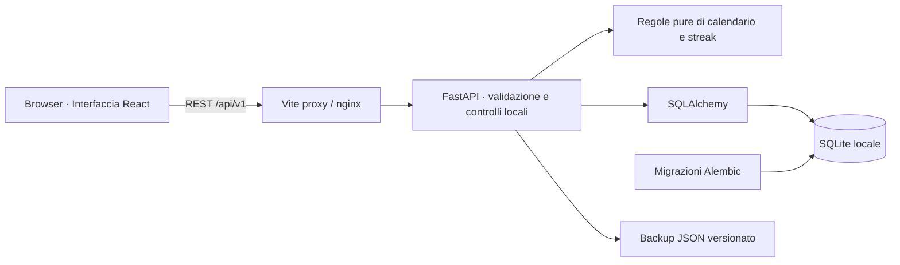

# HabitFlow

**Un ritmo sostenibile, guidato da regole di calendario precise.**

HabitFlow è un tracker di abitudini local-first progettato per piani realistici, progressi tangibili e ripartenze senza sensi di colpa. Più di una semplice spunta o di una serie numerica: supporta giorni della settimana selezionati, obiettivi settimanali flessibili, pause programmate e fusi orari senza alterare o riscrivere la cronologia passata.


Verifica locale e CI: **44 test Python, test di componenti React e scenari end-to-end con browser reale Playwright superati con successo**. Consulta il [report di verifica](docs/verification.md) per i dettagli tecnici e la copertura dei test.

## Cosa puoi fare

- **Pianificazione flessibile:** crea abitudini con obiettivo, icona, colore, data d'inizio e frequenza personalizzata (giornaliera, giorni specifici della settimana o N volte a settimana).
- **Check-in affidabili:** registra o annulla il completamento della giornata in modo idempotente, con note contestuali opzionali.
- **Statistiche e calendario:** visualizza l'attività su calendario, i trend settimanali e mensili, i tassi di completamento relativi al piano effettivo e il calcolo rigoroso delle serie (streak).
- **Gestione del ciclo di vita:** metti in pausa per vacanze o imprevisti, riprendi, archivia, ripristina, modifica, cerca e filtra le tue abitudini.
- **Privacy e controllo locale:** tutti i dati restano salvati in un database SQLite locale. Esporta e importa backup JSON completi senza perdita di dati; esplora l'app con la modalità demo additiva.
- **Interfaccia accessibile:** UI moderna e reattiva in italiano, navigabile da tastiera, con finestre di dialogo accessibili (Radix) e supporto per la riduzione del movimento.
- **Nessuna dipendenza esterna:** nessun account richiesto, nessuna sincronizzazione su cloud terzi e nessuna telemetria.

## Stack tecnologico

- **Backend:** Python 3.12, FastAPI, Pydantic, SQLAlchemy 2, Alembic, SQLite.
- **Frontend:** React, TypeScript, Vite, Tailwind CSS, Radix UI Dialog, Lucide Icons.
- **Testing & Qualità:** Ruff, mypy (strict mode), Pytest, Vitest, Playwright E2E, GitHub Actions CI.



## Avvio locale

Prerequisiti: **Python 3.12**, **Node.js 24 LTS**, npm e Git. Non sono richieste chiavi API né servizi remoti.

### Windows (PowerShell)

Dalla root del repository, apri due terminali:

**Terminale 1 — Backend:**
```powershell
py -3.12 -m venv .venv
.\.venv\Scripts\python.exe -m pip install -e './backend[dev]'
Copy-Item .env.example backend/.env
cd backend
..\.venv\Scripts\python.exe -m alembic upgrade head
..\.venv\Scripts\python.exe -m uvicorn app.main:app --host 127.0.0.1 --port 8000
```

**Terminale 2 — Frontend:**
```powershell
cd frontend
npm ci
npm run dev
```

### macOS / Linux

**Terminale 1 — Backend:**
```bash
python3.12 -m venv .venv
source .venv/bin/activate
python -m pip install -e './backend[dev]'
cp .env.example backend/.env
cd backend
alembic upgrade head
uvicorn app.main:app --host 127.0.0.1 --port 8000
```

**Terminale 2 — Frontend:**
```bash
cd frontend
npm ci
npm run dev
```

Apri **http://127.0.0.1:5173** nel browser. La documentazione interattiva OpenAPI/Swagger è disponibile su **http://127.0.0.1:8000/docs**.

Dalle Impostazioni dell'app è possibile caricare i dati demo per esplorare subito tutte le viste con dati realistici, senza cancellare le abitudini create.

### Docker Compose (opzionale)

```bash
docker compose up --build
```
L'applicazione sarà accessibile su `http://127.0.0.1:8080`. I volumi conservano i dati SQLite anche dopo l'arresto dei container.

## Test e verifica della qualità

Con l'ambiente virtuale attivo (o specificando il percorso Python del venv):

```bash
# Verifica Backend (dalla cartella backend/)
python -m ruff check .
python -m ruff format --check .
python -m mypy app
python -m alembic upgrade head
python -m pytest -ra

# Verifica Frontend (dalla cartella frontend/)
npm run lint
npm run format:check
npm run typecheck
npm test
npm run build

# Test End-to-End nel Browser (dalla cartella frontend/)
npx playwright install --with-deps chromium
npm run test:e2e
```

I test Playwright avviano un'istanza dell'API con un database SQLite temporaneo isolato su porte dedicate, registrando screenshot e verifiche di accessibilità senza toccare i dati di sviluppo. La pipeline CI di GitHub Actions esegue l'intera suite a ogni push.

## Modello dati

| Entità | Scopo |
| --- | --- |
| **Settings** | Nome visualizzato locale, fuso orario di default e stato onboarding |
| **Habit** | Identità, descrizione, scelte visive (icona, colore), data d'inizio e stato ciclo di vita |
| **Schedule revision** | Data di efficacia, frequenza e timezone IANA; le nuove revisioni partono dal lunedì successivo |
| **Pause interval** | Intervalli di sospensione programmati (date civili) per non penalizzare la streak |
| **Check-in** | Completamento unico per abitudine + data civile, audit timestamp UTC, note opzionali |

Il database impone vincoli di unicità giornaliera e chiavi esterne. La data civile di completamento non viene mai ricalcolata a ritroso in caso di cambio fuso orario. I periodi ancora aperti non interrompono la serie corrente. Per i dettagli architetturali, consulta i documenti [Architecture](docs/architecture.md) e [API Contract](docs/api-contract.md).

## Mappa del repository

```text
backend/              API FastAPI, modello di dominio, migrazioni Alembic, test Pytest
frontend/src/         Applicazione React, componenti UI, hook e test Vitest
frontend/e2e/         Test di accettazione end-to-end con Playwright
infra/                Configurazioni Docker e nginx
scripts/              Script di utilità ed esecuzione E2E
docs/                 Specifiche architetturali, decisioni di prodotto, evidenze di verifica
.github/workflows/    Pipeline di integrazione continua (GitHub Actions)
```

## Note di portfolio e licenza

Questo progetto è parte del portfolio tecnico di **Leandro D'Amico** ([GitHub: Leandro-DAmico](https://github.com/Leandro-DAmico)), sviluppato adottando metodologie di ingegneria del software assistita da intelligenza artificiale, architetture a livelli rigorose e validazione automatizzata continua.

Rilasciato con licenza [MIT](LICENSE).
