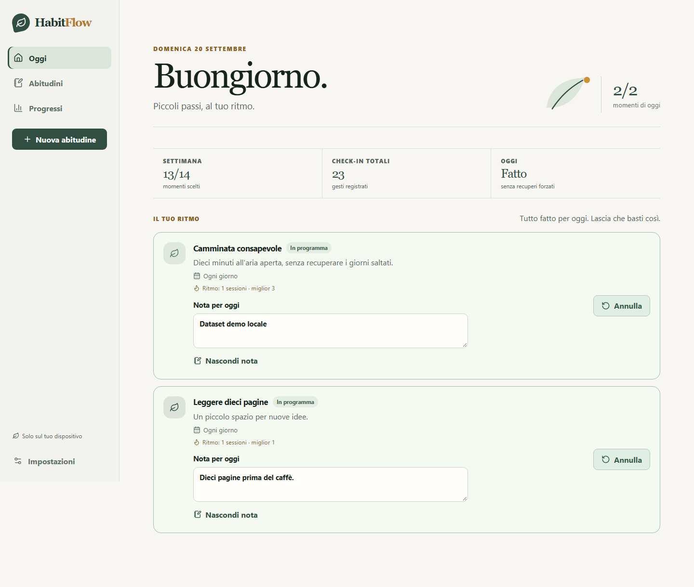
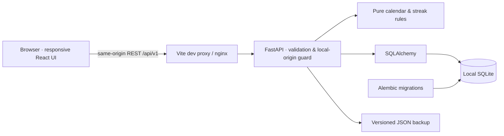

# HabitFlow

**A gentler rhythm, backed by precise calendar rules.**

HabitFlow is a local-first habit tracker for realistic plans, meaningful progress and guilt-free restarts. More than a checkbox and a streak: it understands selected weekdays, weekly targets, pauses and timezones without rewriting your history.



Local verification: **44 Python tests · 8 component tests · 4 real-browser scenarios passed**. See the dated [verification report](docs/verification.md) for scope, screenshots and the untested Docker limitation.

## What you can do

- Create habits with a goal, icon, color, start date and daily / selected days / N-times-a-week schedules.
- Complete or undo a day idempotently, with an optional note.
- See calendar activity, weekly/monthly trends, plan-relative completion rates and correctly labelled streaks.
- Pause, resume, archive, restore, edit, search and filter your habits.
- Keep all data in a local SQLite database. Export/import lossless JSON backups; try an additive, repeatable demo.
- Use a responsive Italian interface with keyboard controls, accessible dialogs and reduced-motion support.

No accounts, cloud sync, telemetry, competitive rankings or real notifications. **Do not expose this single-user API to the public Internet.**

## Stack

Python 3.12 · FastAPI · Pydantic · SQLAlchemy 2 · Alembic · SQLite · React · TypeScript · Vite · Radix Dialog · Lucide.

Radix provides maintained dialog primitives with focus trapping, Escape handling and accessible names while leaving visual design under our control. Native form elements do the simpler jobs. Business metrics live in Python, not duplicated in the UI.



## Run locally

### Android e iPhone

HabitFlow include ora una [vera app mobile](docs/mobile.md) in `mobile/`: interfaccia React Native, SQLite sul telefono, funzionamento senza server e backup JSON compatibile con la versione web. La guida spiega come aprire il progetto generato in Android Studio, provarlo con un emulatore e trasferire i dati. La compilazione iOS richiede macOS e Xcode. Gli [esiti della verifica mobile](docs/mobile-verification.md) distinguono controlli eseguiti e verifiche ancora necessarie.

### Web app

Prerequisites: **Python 3.12**, **Node.js 24 LTS**, npm and Git. Older Node 20.11 is insufficient for the chosen Vite/Vitest versions. No API keys or remote services are required.

### Windows / PowerShell

From the repository root:

```powershell
py -3.12 -m venv .venv
.\.venv\Scripts\python.exe -m pip install -e './backend[dev]'
Copy-Item .env.example backend/.env
cd backend
..\.venv\Scripts\python.exe -m alembic upgrade head
..\.venv\Scripts\python.exe -m uvicorn app.main:app --host 127.0.0.1 --port 8000
```

In a second terminal, from the repository root:

```powershell
cd frontend
npm ci
npm run dev
```

On the prepared Windows workspace, `powershell -ExecutionPolicy Bypass -File scripts/frontend.ps1 run dev` (from the repository root) uses the isolated Node 24 runtime in `.tools/`. It does not replace the machine's older Node installation. On a fresh clone, install Node 24 normally; `.tools/` is intentionally not committed.

### macOS / Linux

```sh
python3.12 -m venv .venv
source .venv/bin/activate
python -m pip install -e './backend[dev]'
cp .env.example backend/.env
cd backend
alembic upgrade head
uvicorn app.main:app --host 127.0.0.1 --port 8000
```

In another terminal: `cd frontend && npm ci && npm run dev`.

Open **http://127.0.0.1:5173**. Complete onboarding or explore first. The demo can be loaded from Settings; it never removes existing data. OpenAPI is at http://127.0.0.1:8000/docs.

Configuration uses `HABITFLOW_DATABASE_URL` and `HABITFLOW_ALLOWED_ORIGINS` (comma-separated exact origins). The default database is `backend/data/habitflow.db` when launched from `backend/`. `.env`, databases and local tooling are ignored by Git. Timezone data is bundled through `tzdata`; no external font or analytics requests are needed.

### Docker Compose (optional)

```sh
docker compose up --build
```

Open http://127.0.0.1:8080. Migrations run before the API starts. Only the frontend is published, on loopback; SQLite persists in the `habitflow-data` volume. `docker compose down` preserves that volume. Export a JSON backup before removing any Docker volume.

## Verification

Activate the virtual environment first, or substitute `.venv/Scripts/python.exe -m` on Windows for Python tool commands.

```sh
# from backend/
ruff check .
ruff format --check .
mypy app
alembic upgrade head
pytest

# from frontend/
npm run lint
npm run format:check
npm run typecheck
npm test
npm run build
npx playwright install chromium
npm run test:e2e

# from repository root; after reviewing/staging your changes
pre-commit install
pre-commit run --all-files
```

Playwright starts a real API with a migrated **temporary database** and a separate Vite server on ports 8001/5174. It does not reset your development data. Browser tests record errors, accessibility checks and real screenshots. GitHub Actions runs the same verification pipeline; browser installation there includes Linux system dependencies.

Actual executed checks and environment limitations are recorded in [verification.md](docs/verification.md). CI configuration is not itself evidence of a successful remote CI run.

## Data model

| Entity | Purpose |
| --- | --- |
| Settings | Local display name, default timezone and onboarding state |
| Habit | Identity, description, visual choices, start date and current lifecycle state |
| Schedule revision | Effective date, IANA timezone and frequency; new plans start next Monday |
| Pause interval | Inactive civil dates, start inclusive / end exclusive |
| Check-in | Unique habit + civil date, UTC audit timestamp, original timezone/revision and note |

The database enforces unique daily check-ins and foreign keys. A completion's civil date is never recalculated from its timestamp after a timezone change. Daily/weekday streaks count planned sessions; weekly schedules count ISO weeks. Open periods do not break a streak. Rates use concluded periods; a zero denominator is shown as no data, not failure. See [architecture and ADRs](docs/architecture.md) and [API contract](docs/api-contract.md).

## Repository map

```text
backend/              API, domain, migrations, Python tests
frontend/src/         React app, styles, component tests
frontend/e2e/         Real-browser acceptance tests
infra/                nginx and frontend Docker build
scripts/              Isolated E2E server
docs/                 ADRs, product decisions, case study, evidence
.github/workflows/    Verification pipeline
```

## Trade-offs

- Local-first means local control, **not encryption at rest**. Protect your OS account and exported backups; notes can contain personal information.
- A single SQLite database is proportionate to a personal tracker. Multiuser authorization and concurrent cloud sync are out of scope.
- Schedule changes begin next Monday to avoid ambiguous partial-week revisions. Start date is immutable after creation.
- JSON is chosen over CSV because it preserves pauses, revisions and audit metadata. Additive imports reject conflicting identities instead of guessing.
- Backend calculations prioritize explicit, tested rules over speculative caching or services. Very large multi-decade datasets need profiling before expansion.
- Automated accessibility tests do not replace manual screen-reader and user testing.

## Roadmap

- Manual screen-reader and usability sessions; add findings without inventing validation metrics.
- More precise backup conflict preview and optional encrypted exports.
- Opt-in desktop reminders behind the existing notification interface.
- Profile large datasets before adding cached analytics.
- Consider offline browser-only/PWA storage or encrypted sync as separate product decisions, not promises of the current architecture.

## Portfolio notes

[Case study](docs/portfolio-case-study.md) · [Italian LinkedIn draft](docs/linkedin-post.md) · [Product decisions](docs/product-decisions.md) · [Verification evidence](docs/verification.md)

This is a portfolio engineering project developed with AI-assisted orchestration and human-reviewable decisions. Demo entries are synthetic. No user adoption, retention, performance or business-impact metrics are claimed.

MIT licensed. Review the copyright attribution before publishing under your own name.
